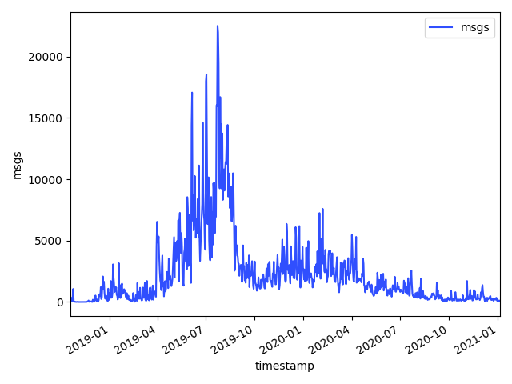
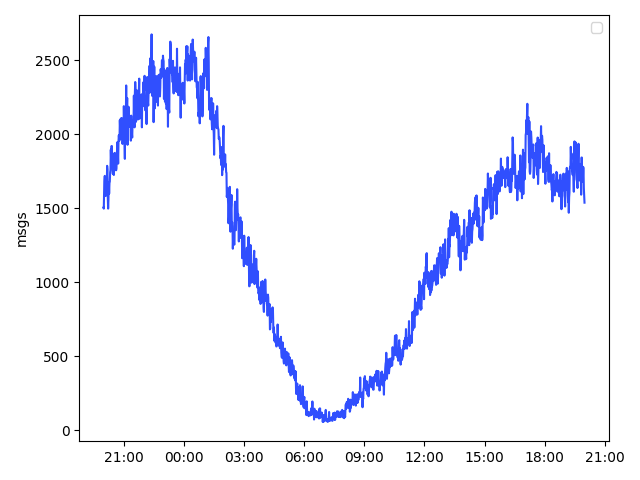
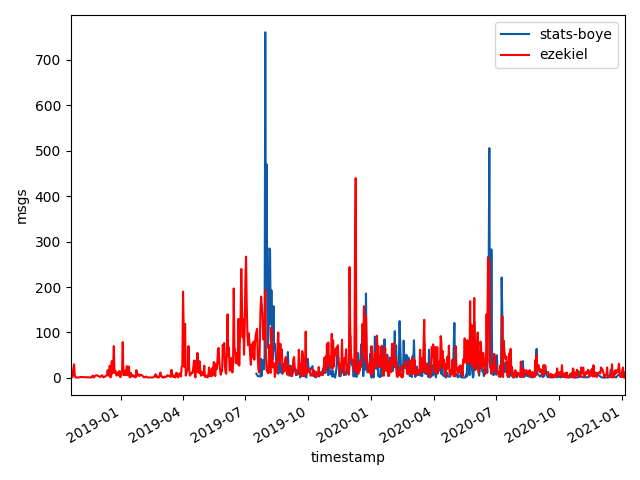
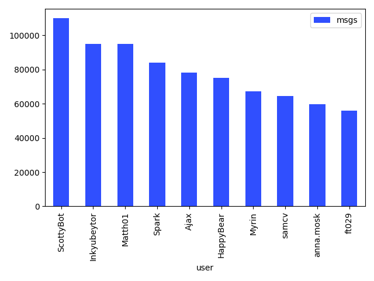
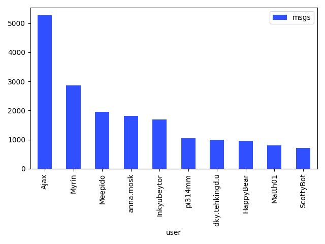
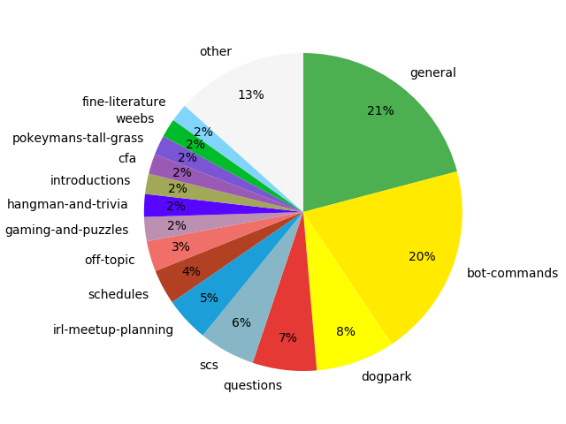
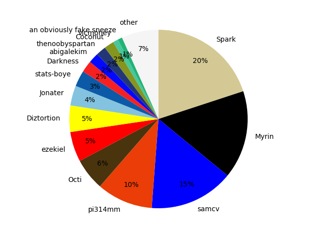

# stats-boye

stats-boye is a Discord bot for showing interesting trends, patterns, and other insights in user message activity on a Discord server. 

## Sample queries and results

### Time graphs

```!time ```



```!time interval:`minute` ```



```!time user:`ezekiel` user:`stats-boye` split-by:`user` ```



### Bar graphs

```!bar```



``` !bar keyword:`lol` ```



### Pie graphs

```!pie ```



```!pie role:`Current Students` split-by:`user` ```


